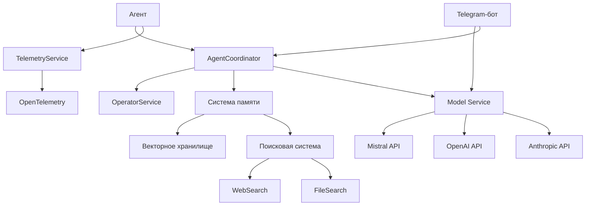

# Архитектура системы

## Общий обзор

Мульти-агентная система построена на основе микросервисной архитектуры, где каждый компонент является независимым сервисом с четко определенными интерфейсами и зоной ответственности.

> **ВАЖНО:** Актуальная конфигурация системы (серверы, порты, модели) находится в файле [docs/SYSTEM_CONFIG.md](docs/SYSTEM_CONFIG.md)

## Ключевые компоненты

### 1. Система памяти

#### 1.1 Долгосрочная память (LongTermMemory)
- Векторное хранилище (VectorStore):
  - Интеграция с Qdrant
  - Управление эмбеддингами
  - Оптимизация поиска
- Система эмбеддингов:
  - Интеграция с Mistral
  - Кэширование векторов
  - Batch-обработка
- Прогрессивная суммаризация:
  - Многоуровневое сжатие
  - Сохранение контекста
  - Оптимизация хранения
- Оценка важности (ImportanceScorer):
  - KeywordBasedScorer: анализ по ключевым словам
  - SemanticScorer: семантическая оценка
  - Метрики и мониторинг
  - Интеграция с основной системой

#### 1.2 Поисковая система
- WebSearchProvider для поиска в интернете
- FileSearchProvider для локального поиска
- Unified Search для объединения результатов
- Система кэширования и индексации

### 2. Система автоматизации

#### 2.1 OperatorService
- Выполнение системных команд
- Управление безопасностью
- Аудит действий
- Обработка ошибок

#### 2.2 AutomationManager
- Шаблоны операций
- Планировщик действий
- Валидация команд
- Интеграция с внешними сервисами

### 3. Мульти-агентное взаимодействие

#### 3.1 AgentCommunicationProtocol
- Маршрутизация сообщений
- Управление диалогами
- Обработка конфликтов
- Синхронизация состояний

#### 3.2 AgentCoordinator
- Распределение задач
- Мониторинг выполнения
- Обработка сбоев
- Балансировка нагрузки

### 4. Интерфейсы взаимодействия

#### 4.1 Telegram-бот
- Интеграция с Telegram API
- Обработка сообщений пользователей
- Управление диалогами
- Прямое подключение к Mistral API
- Интеграция с оркестратором агентов
- Обработка ошибок и восстановление
- Мониторинг состояния

#### 4.2 Интеграция с Mistral
- MistralAdapter для взаимодействия с API:
  - Поддержка стандартного формата OpenAI API
  - Эндпоинт `/v1/chat/completions` для запросов
  - Динамическое определение доступных моделей через `/v1/models`
  - Конфигурируемые параметры генерации (temperature, top_p и др.)
  - Механизм повторных попыток при ошибках
- Система управления моделями:
  - Автоматическое определение доступных моделей
  - Валидация параметров модели
  - Конфигурация по умолчанию для каждой модели
- Асинхронная обработка запросов через httpx
- Система мониторинга здоровья:
  - Отслеживание успешных/неуспешных запросов
  - Автоматическое восстановление после сбоев
  - Метрики производительности
- Механизмы обработки ошибок:
  - Повторные попытки с экспоненциальной задержкой
  - Обработка таймаутов и сетевых ошибок
  - Логирование и диагностика проблем
- Кэширование ответов для оптимизации
- Балансировка нагрузки между экземплярами
- Поддержка потокового режима ответов
- Гибкая система конфигурации моделей

#### 4.3 Сервис моделей (Model Service)
- Унифицированное API для всех языковых моделей
- Слой адаптеров для различных моделей (Mistral, OpenAI, и др.)
- Балансировщик нагрузки между экземплярами моделей
- Система мониторинга и метрик использования моделей
- Протокол асинхронной коммуникации между агентами и моделями
- Система кэширования запросов и ответов
- Механизм отказоустойчивости и восстановления после сбоев
- Возможность горизонтального масштабирования

### 5. Мониторинг и телеметрия

#### 5.1 TelemetryService
- Интеграция OpenTelemetry
- Сбор метрик
- Трейсинг операций
- Система алертов

#### 5.2 ProcessVisualizer
- Визуализация процессов
- Анализ производительности
- Отладка агентов
- Мониторинг ресурсов

## Взаимодействие компонентов

## Технологический стек

### Базовые технологии
- Python 3.10+
- FastAPI
- SQLAlchemy
- Redis
- MongoDB

### AI и ML
- Mistral AI
- Qdrant
- FAISS
- Sentence Transformers

### Мониторинг
- OpenTelemetry
- Prometheus
- Grafana
- Langtrace

### Инфраструктура
- Docker
- Kubernetes
- RabbitMQ
- Nginx

## Безопасность

### Уровни безопасности
1. Аутентификация и авторизация
2. Шифрование данных
3. Аудит действий
4. Контроль доступа

### Безопасность автоматизации
1. Валидация команд
2. Изоляция процессов
3. Ограничение ресурсов
4. Логирование действий

## Масштабирование

### Горизонтальное масштабирование
- Репликация сервисов
- Шардирование данных
- Балансировка нагрузки
- Кэширование

### Вертикальное масштабирование
- Оптимизация ресурсов
- Улучшение производительности
- Асинхронная обработка
- Буферизация

## Развертывание

### Окружения
1. Development
2. Staging
3. Production

### CI/CD
- GitHub Actions
- Автоматическое тестирование
- Непрерывная интеграция
- Автоматический деплой

## Мониторинг и поддержка

### Метрики
- Производительность агентов
- Использование ресурсов
- Качество ответов
- Время отклика

### Алерты
- Критические ошибки
- Превышение лимитов
- Аномалии в работе
- Безопасность

## Дальнейшее развитие

### Приоритетные направления
1. Улучшение автономности агентов
2. Расширение возможностей поиска
3. Оптимизация производительности
4. Развитие системы мониторинга

### Исследования
1. Новые алгоритмы NLP
2. Улучшение принятия решений
3. Оптимизация памяти
4. Развитие мульти-агентного взаимодействия 