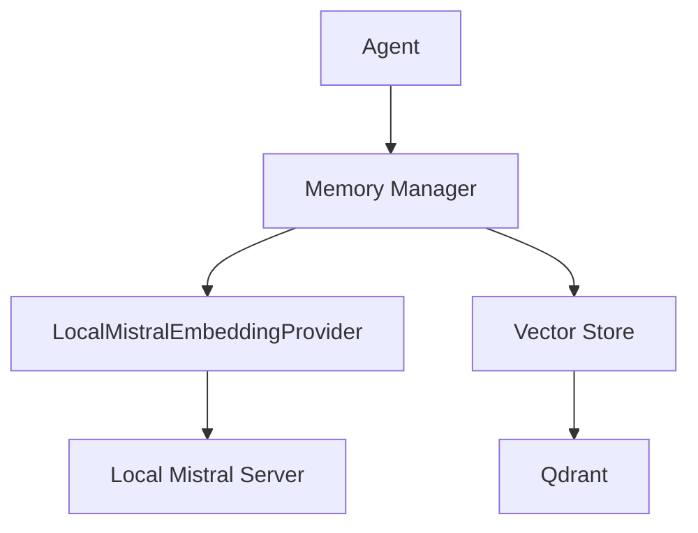

# 🏗️ Архитектура мульти-агентной системы на базе Mistral

## Общая концепция

Мульти-агентная система на базе модели Mistral представляет собой гибридное решение, сочетающее преимущества микросервисной архитектуры с гибкой системой агентов, способных адаптироваться к различным типам задач. Система обеспечивает маршрутизацию запросов между специализированными агентами, контекстную обработку диалогов и автоматическое улучшение на основе анализа пользовательских взаимодействий.

## Ядро системы (Core)

### Менеджер агентов (Agent Manager)

- **Назначение**: Центральный компонент, отвечающий за создание, маршрутизацию и координацию агентов
- **Функциональность**:
  - Динамическое переключение между одноагентным и мульти-агентным режимами
  - Адаптивное распределение задач между агентами
  - Управление жизненным циклом агентов (создание, модификация, удаление)
  - Мониторинг производительности агентов

### Система планирования (Planning System)

- **Назначение**: Анализ и декомпозиция сложных задач на подзадачи
- **Функциональность**:
  - Анализ сложности входящих запросов
  - Разбиение сложных задач на управляемые подзадачи
  - Создание оптимальной последовательности выполнения задач
  - Определение необходимых агентов для решения задачи

### Система памяти (Memory System)

- **Назначение**: Управление контекстом и историей взаимодействий
- **Компоненты**:
  - **Краткосрочная память**: Для хранения контекста текущей сессии
  - **Долгосрочная память**: Персистентное хранилище для сохранения информации между сессиями
  - **Векторное хранилище**: Для эффективного поиска по семантическому контексту
- **Функциональность**:
  - Сохранение и восстановление контекста диалогов
  - Создание семантических индексов для быстрого поиска релевантной информации
  - Управление забыванием неактуальной информации
  - Поддержка мультимодального контекста (текст, изображения, аудио)

## Интеграционный слой (Integration Layer)

### Адаптеры моделей (Model Adapters)

- **Назначение**: Обеспечение унифицированного доступа к различным моделям
- **Функциональность**:
  - Интеграция с Mistral и другими LLM через стандартный интерфейс
  - Автоматическое переключение между моделями в зависимости от задачи
  - Механизмы резервирования при сбоях API
  - Оптимизация параметров запросов для каждой модели
  - Кэширование запросов для экономии ресурсов

### Менеджер инструментов (Tool Manager)

- **Назначение**: Управление доступными инструментами для агентов
- **Функциональность**:
  - Унифицированный API для всех инструментов
  - Система плагинов для расширения функциональности
  - Безопасное выполнение инструментов в изолированной среде
  - Контроль доступа агентов к инструментам
  - Мониторинг использования инструментов

## Сервисный слой (Service Layer)

### API Gateway

- **Назначение**: Единая точка входа для внешних запросов
- **Функциональность**:
  - Маршрутизация запросов к соответствующим микросервисам
  - Аутентификация и авторизация
  - Балансировка нагрузки
  - Мониторинг и логирование запросов
  - Управление таймаутами и повторными попытками

### Сервис телеметрии (Telemetry Service)

- **Назначение**: Сбор и анализ метрик системы
- **Функциональность**:
  - Сбор метрик производительности агентов
  - Логирование действий агентов и инструментов
  - Анализ успешности выполнения задач
  - Генерация отчетов о работе системы
  - Мониторинг здоровья системы

### Система улучшения агентов (Agent Improvement System)

- **Назначение**: Автоматическое улучшение агентов на основе анализа взаимодействий
- **Функциональность**:
  - Сбор и анализ данных о взаимодействиях пользователей с агентами
  - Выявление паттернов и проблем в работе агентов
  - Генерация оптимизированных версий агентов
  - Тестирование улучшений на реальных данных
  - Автоматическое внедрение успешных улучшений

## Внешние интерфейсы

### Telegram Bot Interface

- **Назначение**: Взаимодействие с пользователями через мессенджер Telegram
- **Функциональность**:
  - Обработка входящих сообщений от пользователей
  - Отправка ответов и уведомлений
  - Интерактивное обновление статуса обработки запросов
  - Поддержка мультимедийного контента
  - Управление пользовательскими настройками

### Web API Interface

- **Назначение**: Предоставление программного доступа к системе
- **Функциональность**:
  - RESTful API для интеграции с внешними системами
  - WebSockets для реактивного взаимодействия
  - Документация API через Swagger/OpenAPI
  - Управление ограничениями и квотами
  - Мониторинг использования API

## Архитектурная схема

```
┌─────────────────────────────────────────────────────────────────────────────┐
│                             Внешние интерфейсы                               │
│                                                                             │
│   ┌─────────────────┐                               ┌───────────────────┐   │
│   │  Telegram Bot   │                               │     Web API       │   │
│   └────────┬────────┘                               └─────────┬─────────┘   │
└────────────┼──────────────────────────────────────────────────┼─────────────┘
             │                                                  │
             ▼                                                  ▼
┌─────────────────────────────────────────────────────────────────────────────┐
│                              API Gateway                                     │
└─────────────────────────────────────┬───────────────────────────────────────┘
                                       │
                                       ▼
┌─────────────────────────────────────────────────────────────────────────────┐
│                             Сервисный слой                                   │
│                                                                             │
│   ┌─────────────────┐      ┌─────────────────┐      ┌───────────────────┐   │
│   │   Телеметрия    │      │ Система улучш.  │      │    Другие         │   │
│   │                 │      │    агентов      │      │    сервисы        │   │
│   └────────┬────────┘      └────────┬────────┘      └─────────┬─────────┘   │
└────────────┼─────────────────────────┼─────────────────────────┼─────────────┘
             │                         │                         │
             ▼                         ▼                         ▼
┌─────────────────────────────────────────────────────────────────────────────┐
│                            Интеграционный слой                               │
│                                                                             │
│   ┌─────────────────┐                               ┌───────────────────┐   │
│   │    Адаптеры     │                               │    Менеджер       │   │
│   │    моделей      │                               │   инструментов    │   │
│   └────────┬────────┘                               └─────────┬─────────┘   │
└────────────┼──────────────────────────────────────────────────┼─────────────┘
             │                                                  │
             ▼                                                  ▼
┌─────────────────────────────────────────────────────────────────────────────┐
│                                Ядро системы                                  │
│                                                                             │
│  ┌─────────────────┐      ┌─────────────────┐      ┌────────────────────┐   │
│  │    Менеджер     │      │     Система     │      │      Система       │   │
│  │     агентов     │──────│   планирования  │──────│      памяти        │   │
│  └─────────────────┘      └─────────────────┘      └────────────────────┘   │
│                                                                             │
└─────────────────────────────────────────────────────────────────────────────┘
```

## Взаимодействие компонентов

1. **Обработка запроса**:
   - Запрос поступает через внешний интерфейс (Telegram Bot или Web API)
   - API Gateway маршрутизирует запрос к соответствующему сервису
   - Менеджер агентов анализирует запрос и определяет режим работы (одноагентный или мульти-агентный)
   - Система планирования разбивает сложные задачи на подзадачи
   - Агенты выполняют задачи, используя доступные инструменты и модели
   - Результаты возвращаются пользователю через соответствующий интерфейс

2. **Автоматическое улучшение**:
   - Сервис телеметрии собирает данные о взаимодействиях
   - Система улучшения агентов анализирует собранные данные
   - Генерируются улучшенные версии агентов
   - Улучшения тестируются на исторических данных
   - Успешные улучшения автоматически внедряются

## Ключевые особенности архитектуры

1. **Гибридный подход**: Сочетание микросервисной архитектуры и гибкой системы агентов
2. **Адаптивность**: Динамическое переключение между режимами работы в зависимости от сложности задачи
3. **Расширяемость**: Модульный дизайн с возможностью легкого добавления новых компонентов
4. **Самооптимизация**: Автоматическое улучшение системы на основе анализа реальных взаимодействий
5. **Отказоустойчивость**: Механизмы резервирования и восстановления при сбоях
6. **Масштабируемость**: Независимое масштабирование отдельных компонентов системы
7. **Безопасность**: Изолированное выполнение потенциально опасных операций

## Технологический стек

- **Языки программирования**: Python
- **Фреймворки**: LangChain, FastAPI
- **Базы данных**: PostgreSQL, Redis, Pinecone (для векторного хранилища)
- **Модели**: Mistral, с поддержкой других моделей через адаптеры
- **Инфраструктура**: Docker, Kubernetes (опционально)
- **Мониторинг**: Prometheus, Grafana
- **CI/CD**: GitHub Actions, Render

## Принципы разработки

1. **Модульность**: Каждый компонент должен быть независимым и легко заменяемым
2. **Тестируемость**: Все компоненты должны быть покрыты автоматическими тестами
3. **Документированность**: Подробная документация API и внутренних механизмов
4. **Конфигурируемость**: Все параметры системы должны быть настраиваемыми
5. **Обратная совместимость**: Изменения не должны нарушать существующую функциональность
6. **Прозрачность**: Все действия системы должны быть логируемыми и объяснимыми
7. **Эффективность**: Оптимальное использование вычислительных ресурсов

## Компоненты системы

### Система памяти

#### Embedding Service
- **LocalMistralEmbeddingProvider**: Сервис для генерации эмбеддингов на основе локальной модели Mistral
  - Развернут как отдельный микросервис
  - Предоставляет HTTP API для получения эмбеддингов
  - Масштабируется горизонтально при необходимости
  - Интегрирован с системой мониторинга для отслеживания производительности


