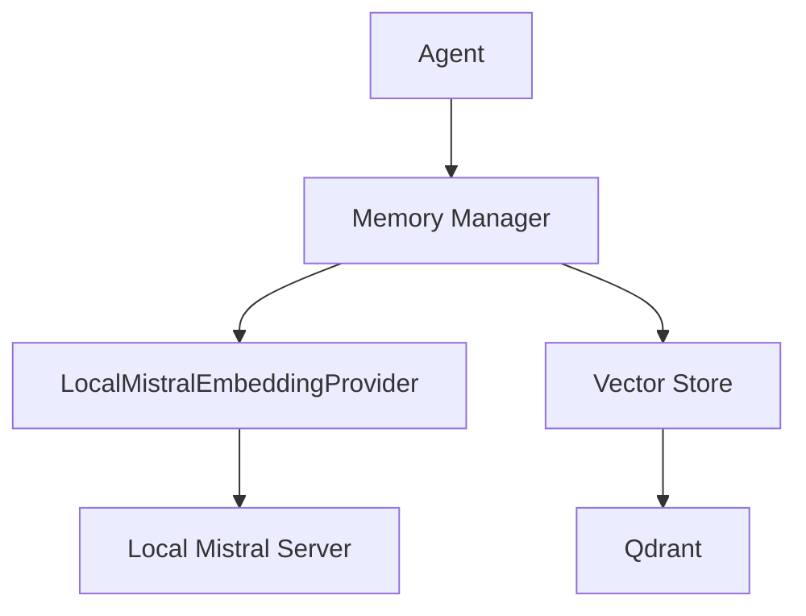

# 🏗️ Архитектура мульти-агентной системы на базе Mistral

## Общая концепция

Мульти-агентная система на базе модели Mistral представляет собой гибридное решение, сочетающее преимущества микросервисной архитектуры с гибкой системой агентов, способных адаптироваться к различным типам задач. Система обеспечивает маршрутизацию запросов между специализированными агентами, контекстную обработку диалогов и автоматическое улучшение на основе анализа пользовательских взаимодействий.

## Ядро системы (Core)

### Менеджер агентов (Agent Manager)

- **Назначение**: Центральный компонент, отвечающий за создание, маршрутизацию и координацию агентов
- **Функциональность**:
  - Динамическое переключение между одноагентным и мульти-агентным режимами
  - Адаптивное распределение задач между агентами
  - Управление жизненным циклом агентов (создание, модификация, удаление)
  - Мониторинг производительности агентов

### Система планирования (Planning System)

- **Назначение**: Анализ и декомпозиция сложных задач на подзадачи
- **Функциональность**:
  - Анализ сложности входящих запросов
  - Разбиение сложных задач на управляемые подзадачи
  - Создание оптимальной последовательности выполнения задач
  - Определение необходимых агентов для решения задачи

### Система памяти (Memory System)

- **Назначение**: Управление контекстом и историей взаимодействий
- **Компоненты**:
  - **Краткосрочная память**: Для хранения контекста текущей сессии
  - **Долгосрочная память**: Персистентное хранилище для сохранения информации между сессиями
  - **Векторное хранилище**: Для эффективного поиска по семантическому контексту
- **Функциональность**:
  - Сохранение и восстановление контекста диалогов
  - Создание семантических индексов для быстрого поиска релевантной информации
  - Управление забыванием неактуальной информации
  - Поддержка мультимодального контекста (текст, изображения, аудио)

## Интеграционный слой (Integration Layer)

### Адаптеры моделей (Model Adapters)

- **Назначение**: Обеспечение унифицированного доступа к различным моделям
- **Функциональность**:
  - Интеграция с Mistral, Gemma 3 и другими LLM через стандартный интерфейс
  - Автоматическое переключение между моделями в зависимости от задачи
  - Механизмы резервирования при сбоях API
  - Оптимизация параметров запросов для каждой модели
  - Кэширование запросов для экономии ресурсов

#### Архитектура гибридной модельной системы

- **Состав**:
  - **MistralAdapter**: Адаптер для работы с Mistral API
  - **GemmaAdapter**: Планируемый адаптер для работы с Gemma 3
  - **ModelService**: Унифицированный сервис для взаимодействия с моделями
  - **ModelSelector**: Компонент для выбора оптимальной модели в зависимости от запроса

- **Принципы работы**:
  1. **Унификация интерфейса**: Все модели доступны через единый API, скрывающий различия в их реализации
  2. **Специализация моделей**: Выбор оптимальной модели в зависимости от типа запроса:
     - Mistral - для простых текстовых запросов
     - Gemma 3 - для мультимодальных запросов и задач, требующих большого контекста
  3. **Отказоустойчивость**: Автоматическое переключение на альтернативную модель при недоступности предпочтительной
  4. **Оптимизация ресурсов**: Балансировка нагрузки и динамический выбор размера модели (для Gemma 3)

- **Характеристики адаптеров**:
  - **MistralAdapter**:
    - Оптимизирован для работы с текстовыми запросами
    - Поддерживает контекст до ~8K токенов
    - Имеет механизмы обработки ошибок и восстановления после сбоев
    - Интегрирован с системой кэширования

  - **GemmaAdapter (планируемый)**:
    - Будет поддерживать мультимодальные запросы (текст + изображения)
    - Обеспечит работу с контекстом до 128K токенов
    - Реализует интерфейс для function calling
    - Будет оптимизирован для работы с разными размерами моделей (1B-27B)
    - Поддержит официальные квантизированные версии

  - **ModelSelector**:
    - Анализ содержимого запроса для определения оптимальной модели
    - Учет текущей нагрузки на сервера при выборе экземпляра модели
    - Маршрутизация запросов на основе политик (качество, скорость, стоимость)
    - Сбор и анализ метрик эффективности для оптимизации выбора

- **Преимущества гибридного подхода**:
  1. **Оптимизация ресурсов**: Использование более легких моделей для простых задач
  2. **Улучшение качества**: Применение специализированных моделей для сложных задач
  3. **Отказоустойчивость**: Резервирование при недоступности отдельных моделей
  4. **Гибкость**: Возможность быстрого подключения новых моделей без изменения клиентского кода
  5. **Масштабируемость**: Балансировка нагрузки между экземплярами моделей

### Менеджер инструментов (Tool Manager)

- **Назначение**: Управление доступными инструментами для агентов
- **Функциональность**:
  - Унифицированный API для всех инструментов
  - Система плагинов для расширения функциональности
  - Безопасное выполнение инструментов в изолированной среде
  - Контроль доступа агентов к инструментам
  - Мониторинг использования инструментов

## Сервисный слой (Service Layer)

### API Gateway

- **Назначение**: Единая точка входа для внешних запросов
- **Функциональность**:
  - Маршрутизация запросов к соответствующим микросервисам
  - Аутентификация и авторизация
  - Балансировка нагрузки
  - Мониторинг и логирование запросов
  - Управление таймаутами и повторными попытками

### Сервис телеметрии (Telemetry Service)

- **Назначение**: Сбор и анализ метрик системы
- **Функциональность**:
  - Сбор метрик производительности агентов
  - Логирование действий агентов и инструментов
  - Анализ успешности выполнения задач
  - Генерация отчетов о работе системы
  - Мониторинг здоровья системы

### Система улучшения агентов (Agent Improvement System)

- **Назначение**: Автоматическое улучшение агентов на основе анализа взаимодействий
- **Функциональность**:
  - Сбор и анализ данных о взаимодействиях пользователей с агентами
  - Выявление паттернов и проблем в работе агентов
  - Генерация оптимизированных версий агентов
  - Тестирование улучшений на реальных данных
  - Автоматическое внедрение успешных улучшений

## Внешние интерфейсы

### Telegram Bot Interface

- **Назначение**: Взаимодействие с пользователями через мессенджер Telegram
- **Функциональность**:
  - Обработка входящих сообщений от пользователей
  - Отправка ответов и уведомлений
  - Интерактивное обновление статуса обработки запросов
  - Поддержка мультимедийного контента
  - Управление пользовательскими настройками

### Web API Interface

- **Назначение**: Предоставление программного доступа к системе
- **Функциональность**:
  - RESTful API для интеграции с внешними системами
  - WebSockets для реактивного взаимодействия
  - Документация API через Swagger/OpenAPI
  - Управление ограничениями и квотами
  - Мониторинг использования API

## Архитектурная схема

```
┌─────────────────────────────────────────────────────────────────────────────┐
│                             Внешние интерфейсы                               │
│                                                                             │
│   ┌─────────────────┐                               ┌───────────────────┐   │
│   │  Telegram Bot   │                               │     Web API       │   │
│   └────────┬────────┘                               └─────────┬─────────┘   │
└────────────┼──────────────────────────────────────────────────┼─────────────┘
             │                                                  │
             ▼                                                  ▼
┌─────────────────────────────────────────────────────────────────────────────┐
│                              API Gateway                                     │
└─────────────────────────────────────┬───────────────────────────────────────┘
                                       │
                                       ▼
┌─────────────────────────────────────────────────────────────────────────────┐
│                             Сервисный слой                                   │
│                                                                             │
│   ┌─────────────────┐      ┌─────────────────┐      ┌───────────────────┐   │
│   │   Телеметрия    │      │ Система улучш.  │      │    Другие         │   │
│   │                 │      │    агентов      │      │    сервисы        │   │
│   └────────┬────────┘      └────────┬────────┘      └─────────┬─────────┘   │
└────────────┼─────────────────────────┼─────────────────────────┼─────────────┘
             │                         │                         │
             ▼                         ▼                         ▼
┌─────────────────────────────────────────────────────────────────────────────┐
│                            Интеграционный слой                               │
│                                                                             │
│   ┌─────────────────┐                               ┌───────────────────┐   │
│   │    Адаптеры     │                               │    Менеджер       │   │
│   │    моделей      │                               │   инструментов    │   │
│   └────────┬────────┘                               └─────────┬─────────┘   │
└────────────┼──────────────────────────────────────────────────┼─────────────┘
             │                                                  │
             ▼                                                  ▼
┌─────────────────────────────────────────────────────────────────────────────┐
│                                Ядро системы                                  │
│                                                                             │
│  ┌─────────────────┐      ┌─────────────────┐      ┌────────────────────┐   │
│  │    Менеджер     │      │     Система     │      │      Система       │   │
│  │     агентов     │──────│   планирования  │──────│      памяти        │   │
│  └─────────────────┘      └─────────────────┘      └────────────────────┘   │
│                                                                             │
└─────────────────────────────────────────────────────────────────────────────┘
```

## Взаимодействие компонентов

1. **Обработка запроса**:
   - Запрос поступает через внешний интерфейс (Telegram Bot или Web API)
   - API Gateway маршрутизирует запрос к соответствующему сервису
   - Менеджер агентов анализирует запрос и определяет режим работы (одноагентный или мульти-агентный)
   - Система планирования разбивает сложные задачи на подзадачи
   - Агенты выполняют задачи, используя доступные инструменты и модели
   - Результаты возвращаются пользователю через соответствующий интерфейс

2. **Автоматическое улучшение**:
   - Сервис телеметрии собирает данные о взаимодействиях
   - Система улучшения агентов анализирует собранные данные
   - Генерируются улучшенные версии агентов
   - Улучшения тестируются на исторических данных
   - Успешные улучшения автоматически внедряются

## Ключевые особенности архитектуры

1. **Гибридный подход**: Сочетание микросервисной архитектуры и гибкой системы агентов
2. **Адаптивность**: Динамическое переключение между режимами работы в зависимости от сложности задачи
3. **Расширяемость**: Модульный дизайн с возможностью легкого добавления новых компонентов
4. **Самооптимизация**: Автоматическое улучшение системы на основе анализа реальных взаимодействий
5. **Отказоустойчивость**: Механизмы резервирования и восстановления при сбоях
6. **Масштабируемость**: Независимое масштабирование отдельных компонентов системы
7. **Безопасность**: Изолированное выполнение потенциально опасных операций

## Технологический стек

- **Языки программирования**: Python
- **Фреймворки**: LangChain, FastAPI
- **Базы данных**: PostgreSQL, Redis, Pinecone (для векторного хранилища)
- **Модели**: Mistral, с поддержкой других моделей через адаптеры
- **Инфраструктура**: Docker, Kubernetes (опционально)
- **Мониторинг**: Prometheus, Grafana
- **CI/CD**: GitHub Actions, Render

## Принципы разработки

1. **Модульность**: Каждый компонент должен быть независимым и легко заменяемым
2. **Тестируемость**: Все компоненты должны быть покрыты автоматическими тестами
3. **Документированность**: Подробная документация API и внутренних механизмов
4. **Конфигурируемость**: Все параметры системы должны быть настраиваемыми
5. **Обратная совместимость**: Изменения не должны нарушать существующую функциональность
6. **Прозрачность**: Все действия системы должны быть логируемыми и объяснимыми
7. **Эффективность**: Оптимальное использование вычислительных ресурсов

## Компоненты системы

### Система памяти

#### Embedding Service
- **LocalMistralEmbeddingProvider**: Сервис для генерации эмбеддингов на основе локальной модели Mistral
  - Развернут как отдельный микросервис
  - Предоставляет HTTP API для получения эмбеддингов
  - Масштабируется горизонтально при необходимости
  - Интегрирован с системой мониторинга для отслеживания производительности



## Telegram-бот и интеграция с ModelService (18 марта 2025)

### Архитектура интеграции

Интеграция Telegram-бота с сервисом моделей (ModelService) реализована через клиентский класс `ModelServiceClient`. Это обеспечивает унифицированный интерфейс для взаимодействия с различными языковыми моделями и повышает надежность системы.

#### Архитектурная схема

```
+----------------+     +-------------------+     +---------------+     +----------------+
|                |     |                   |     |               |     |                |
| Telegram API   +---->| Telegram Bot      +---->| ModelService  +---->| Model Adapters |
|                |     | (telegram_bot.py) |     | Client        |     | (Mistral, etc.)|
+----------------+     +-------------------+     +---------------+     +----------------+
                                                        |
                                                        v
                                               +------------------+
                                               |                  |
                                               | Response Cache   |
                                               |                  |
                                               +------------------+
```

#### Компоненты интеграции

1. **Telegram Bot** (`telegram_bot/telegram_bot.py`)
   - Обрабатывает команды и сообщения пользователей
   - Управляет историей диалогов
   - Взаимодействует с сервисом моделей через ModelServiceClient

2. **ModelServiceClient** (`telegram_bot/model_service_client.py`)
   - Представляет собой клиентский интерфейс для ModelService
   - Обеспечивает асинхронное взаимодействие с сервисом моделей
   - Реализует механизмы обработки ошибок и повторных попыток
   - Включает локальное кэширование ответов для оптимизации

3. **ModelService** (`src/model_service/service.py`)
   - Предоставляет унифицированный API для различных языковых моделей
   - Регистрирует и управляет моделями через соответствующие адаптеры
   - Поддерживает балансировку нагрузки между экземплярами моделей

4. **ModelAdapter** (`src/model_service/adapter.py`)
   - Абстрактный класс, определяющий интерфейс для всех адаптеров моделей
   - Конкретные реализации (например, MistralAdapter) обеспечивают взаимодействие с API конкретных моделей

### Потоки данных

1. **Запрос пользователя**
   - Пользователь отправляет сообщение в Telegram
   - Telegram API передает сообщение боту

2. **Обработка запроса**
   - Telegram-бот добавляет сообщение пользователя в историю диалога
   - Бот формирует запрос к ModelServiceClient, включая всю историю диалога
   - ModelServiceClient проверяет кэш на наличие ответа для идентичного запроса

3. **Генерация ответа**
   - Если ответ не найден в кэше, ModelServiceClient обращается к ModelService
   - ModelService выбирает подходящий адаптер модели и передает ему запрос
   - Адаптер взаимодействует с API модели и получает ответ
   - Ответ возвращается обратно через цепочку компонентов

4. **Ответ пользователю**
   - Telegram-бот добавляет ответ модели в историю диалога
   - Ответ отправляется пользователю через Telegram API

### Механизмы обеспечения надежности

1. **Повторные попытки**
   - ModelServiceClient реализует механизм повторных попыток с экспоненциальной задержкой
   - При временной недоступности сервера запрос автоматически повторяется

2. **Кэширование**
   - Ответы на одинаковые запросы кэшируются для снижения нагрузки и времени отклика
   - Кэш имеет ограниченный размер с механизмом вытеснения старых записей

3. **Обработка ошибок**
   - Реализована детальная обработка различных типов ошибок
   - Пользователю предоставляется информативное сообщение при возникновении проблем

### Асинхронная обработка

Все компоненты используют асинхронные операции для эффективного использования ресурсов:
- Методы ModelServiceClient используют `async/await`
- Обработчики сообщений в Telegram-боте также асинхронные
- Адаптеры моделей обеспечивают асинхронное взаимодействие с API

### Расширяемость

Архитектура обеспечивает простое добавление новых моделей:
1. Создание нового адаптера, наследующего от ModelAdapter
2. Регистрация адаптера в ModelService
3. ModelServiceClient автоматически получает доступ к новой модели

## Агенты (Agents)

### Базовый агент (Base Agent)

- **Назначение**: Абстрактный класс, определяющий общий интерфейс и функциональность для всех агентов
- **Функциональность**:
  - Обработка сообщений пользователя
  - Взаимодействие с моделью Mistral через унифицированный API
  - Управление контекстом и историей диалога
  - Поддержка асинхронной обработки

### Агент улучшения кода (Code Improvement Agent)

- **Назначение**: Специализированный агент для анализа и улучшения исходного кода
- **Функциональность**:
  - Анализ кода на различных языках программирования
  - Выявление проблем и предложение улучшений
  - Автоматическое применение улучшений с учетом контекста
  - Объяснение предложенных изменений
- **Компоненты**:
  - **CodeAnalyzer** - анализатор кода для различных языков программирования
  - **ImprovementTracker** - модуль отслеживания и оценки улучшений кода
  - **CodeTransformer** - модуль для безопасной модификации кода

### Трекер улучшений кода (Improvement Tracker)

- **Назначение**: Отслеживание и оценка улучшений кода
- **Функциональность**:
  - Отслеживание множественных версий кода
  - Хранение предложений по улучшению и результатов их применения
  - Оценка эффективности улучшений с помощью метрик
  - Ведение истории улучшений для каждого пользователя
- **Компоненты**:
  - **CodeVersion** - представление версии кода с метриками
  - **ImprovementSuggestion** - предложения по улучшению кода
  - **ImprovementResult** - результаты применения улучшений

### Агент ответов на вопросы (Q&A Agent)
